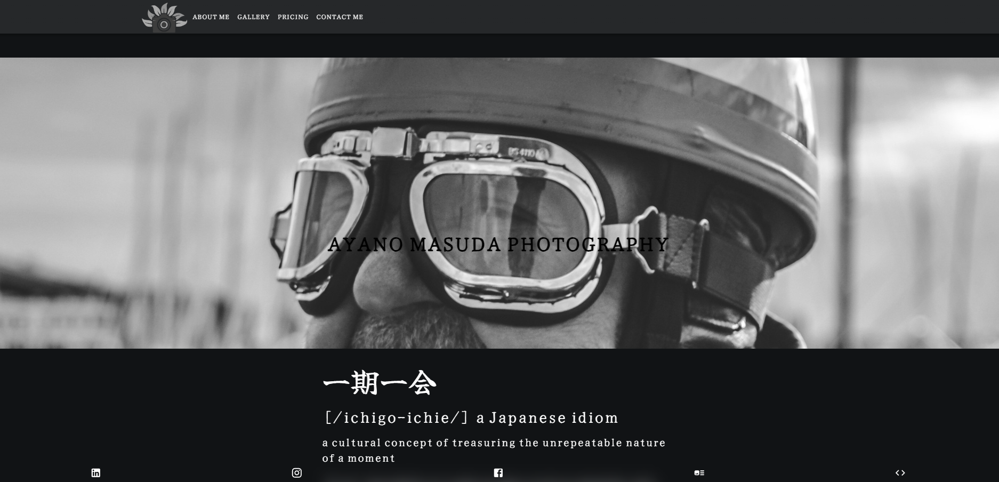

Hello and welcome to my most recent project. I have deployed this repository at "https://photographer-site-gamma.vercel.app/" to make the viewing of this repository easier for anyone who wishes to view it.

This is a fun project I have been working on during my free time for a friend who has recently turned a long-term hobby into a business.

If you wish to run this repository on localhost:3000 please follow the steps below:

Step 1: Clone repository

Step 2: Navigate into the folder/repository

Step 3: run "npm install" in terminal, wait one minute for npm packages to install.

Step 4: run "npm run dev" in terminal and view the repository at http://localhost:3000/

## General information about this repository:

This repository was built using a range of npm packages, however it mainly consists of React, Tailwind CSS, and emailJS.
